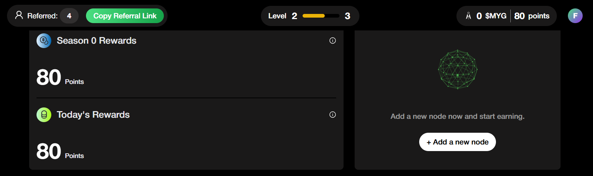
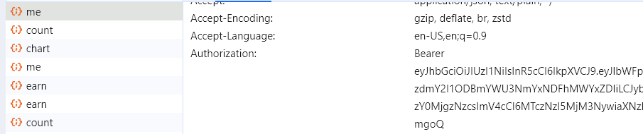

# 🌐 MyGate Network Bot

<div align="center">
  
  
  
  
  
</div>

## 📋 Features

- ✨ **Auto Generate Node ID**
- 🔄 **Auto Connect/Ping Node**
- 🔁 **Auto Reconnect Node**
- 👥 **Multi-Account Support**
- 🔒 **Proxy Support (HTTP/SOCKS4/SOCKS5)**
- 📊 **Real-time Status Monitoring**
- 🎯 **Auto Quest Completion**
- ⚡ **Optimized Performance**

## 🔧 Prerequisites

- Node.js (v16 or higher)
- npm (Node Package Manager)
- Active MyGate Network Account
- Internet Connection

## 💻 Installation

### Windows

1. Install [Node.js](https://nodejs.org/) (LTS version recommended)
2. Download and extract this repository
3. Open Command Prompt in the extracted folder
4. Run installation:
```bash
npm install
```

### Linux/Ubuntu
```bash
# Install Node.js and npm
curl -fsSL https://deb.nodesource.com/setup_lts.x | sudo -E bash -
sudo apt-get install -y nodejs

# Clone and install
git clone https://github.com/Fl3xxRichie/mygate.git
cd mygate
npm install
```

### macOS
```bash
# Install Homebrew if not installed
/bin/bash -c "$(curl -fsSL https://raw.githubusercontent.com/Homebrew/install/HEAD/install.sh)"

# Install Node.js
brew install node

# Clone and install
git clone https://github.com/Fl3xxRichie/mygate.git
cd mygate
npm install
```

### Termux (Android)
```bash
# Update packages
pkg update && pkg upgrade

# Install required packages
pkg install nodejs-lts git

# Clone and install
git clone https://github.com/Fl3xxRichie/mygate.git
cd mygate
npm install
```

## ⚙️ Configuration

### 1. Token Setup
1. Open [MyGate Platform](https://app.mygate.network/login?code=QFQYyC)
2. Login with your Gmail account
3. Press F12 or inspect element
4. Go to Network tab
5. Copy your token
6. Create/edit `tokens.txt`:
```bash
nano tokens.txt  # or use any text editor
```
7. Paste your token(s), one per line

### 2. Proxy Setup (Optional)
Create/edit `proxy.txt` and add your proxies in the format:
```
http://username:password@ip:port
socks4://username:password@ip:port
socks5://username:password@ip:port
```

## 🚀 Usage

Start the bot:
```bash
npm run start
```

## 📝 Notes

- One account = One node (multiple nodes per account not supported yet)
- Ensure stable internet connection
- Use proxies for better reliability
- Keep your tokens secure

## 🔍 Troubleshooting

### Common Issues:

1. **Connection Errors**
   - Check your internet connection
   - Verify proxy settings if using proxies
   - Ensure token is valid

2. **Node.js Errors**
   - Verify Node.js installation: `node --version`
   - Try reinstalling dependencies: `npm install`

3. **Token Issues**
   - Ensure token format is correct
   - Check if token is still valid
   - Re-login and get new token if necessary

## 🔐 Security

- Never share your tokens
- Use secure proxies if possible
- Regularly update your tokens
- Monitor account activity

## 📊 Performance Tips

- Use stable internet connection
- Implement proper proxy rotation
- Don't overload with too many accounts
- Monitor system resources

## 🔄 Updates

Check for updates regularly:
```bash
git pull origin main
npm install
```

## 📜 License

This project is licensed under the [MIT License](LICENSE).

## 🤝 Contributing

Contributions are welcome! Feel free to:
- Report bugs
- Suggest features
- Submit pull requests

## ⚠️ Disclaimer

This bot is for educational purposes only. Use at your own risk. The developers are not responsible for any consequences of using this bot.

## 📞 Support

For issues and updates, visit our GitHub repository or join our Telegram community.
- Private Channel: [Premium Script](https://t.me/+GIfY4Pb0Spw5OGZk)
- Public Channel: [Airdrop3arn](https://t.me/airdrop3arn)
- Direct Contact: [FlexxRichie](https://t.me/flexxrichie)
- Twitter: [@FlexxRichie](https://twitter.com/FlexxRichie)
- GitHub: [@Fl3xxRichie](https://github.com/Fl3xxRichie)

---
Made with ❤️ by Fl3xxRichie
